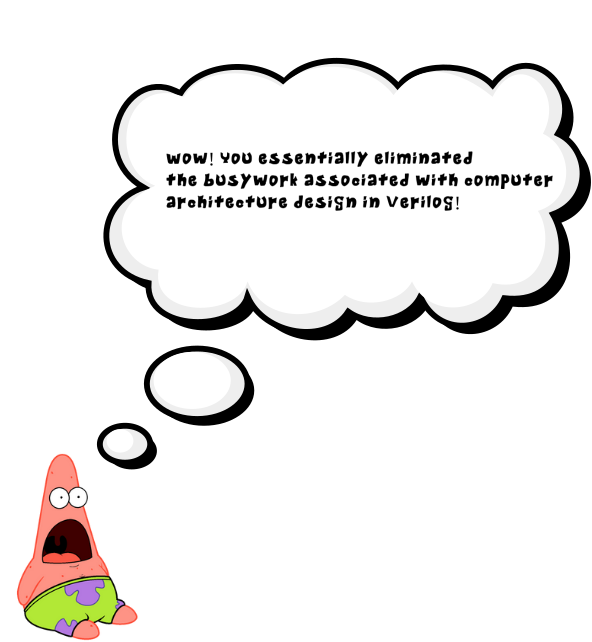

[![Contributors][contributors-shield]][contributors-url]
[![Forks][forks-shield]][forks-url]
[![Stargazers][stars-shield]][stars-url]
[![Issues][issues-shield]][issues-url]




```console
# Build from source: 
cd ~
sudo rm -r yosys
mkdir yosys
cd yosys
sudo docker pull ubuntu:latest
sudo docker run -it --rm ubuntu:latest
apt update && apt install git wget -y && wget https://github.com/YosysHQ/oss-cad-suite-build/releases/download/2024-12-26/oss-cad-suite-linux-x64-20241226.tgz && \
tar -xvzf oss-cad-suite-linux-x64-20241226.tgz
cd oss-cad-suite
source ./environment
apt install npm -y && git clone https://github.com/nturley/netlistsvg
cd netlistsvg
npm install
npm install -g .
npm install elkjs --force
git clone https://github.com/benipoo/yosys-docker.git
cd yosys-docker/example_project_directory/
rm -R -- */ ; 
for file in *.v; do dir=${file%%.*} ; mkdir -p "$dir" ; cp "$file" "$dir" ; cd "$dir" ; yosys -p 'synth -auto-top ; abc -g NAND; write_verilog output.v' "$file" -p 'write_json answer.json';  netlistsvg answer.json ; cd ../ ; done
git add .
git config --global user.email
git commit -m "commit message"
git push
```

<!-- MARKDOWN LINKS & IMAGES -->
<!-- https://www.markdownguide.org/basic-syntax/#reference-style-links -->
[contributors-shield]: https://img.shields.io/github/contributors/benipoo/yosys-docker.svg?style=for-the-badge
[contributors-url]: https://github.com/benipoo/yosys-docker/graphs/contributors
[forks-shield]: https://img.shields.io/github/forks/benipoo/yosys-docker.svg?style=for-the-badge
[forks-url]: https://github.com/benipoo/yosys-docker/network/members
[stars-shield]: https://img.shields.io/github/stars/benipoo/yosys-docker.svg?style=for-the-badge
[stars-url]: https://github.com/benipoo/yosys-docker/stargazers
[issues-shield]: https://img.shields.io/github/issues/benipoo/yosys-docker.svg?style=for-the-badge
[issues-url]: https://github.com/benipoo/yosys-docker/issues
YéYp»Ê¹miôjËØve9bZWÂfQÇì
