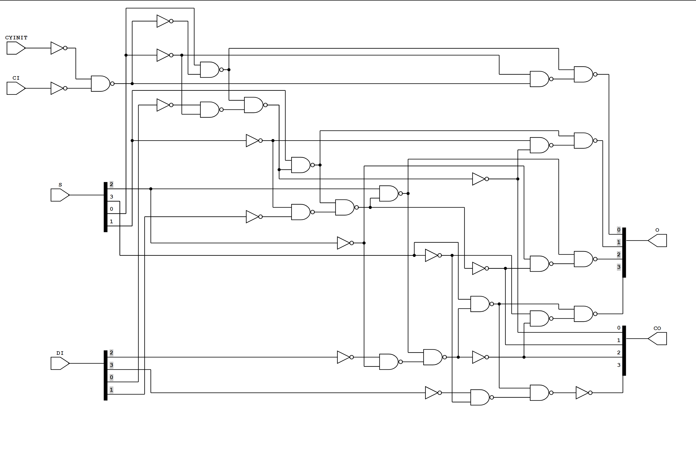

<!-- PROJECT SHIELDS -->
<!--
*** I'm using markdown "reference style" links for readability.
*** Reference links are enclosed in brackets [ ] instead of parentheses ( ).
*** See the bottom of this document for the declaration of the reference variables
*** for contributors-url, forks-url, etc. This is an optional, concise syntax you may use.
*** https://www.markdownguide.org/basic-syntax/#reference-style-links
-->

[![Contributors][contributors-shield]][contributors-url]
[![Forks][forks-shield]][forks-url]
[![Stargazers][stars-shield]][stars-url]
[![Issues][issues-shield]][issues-url]
[](https://benipoo-effective-orbit-757w744799vfxrgg.github.dev/)


   ```console
   cd ~
   sudo rm -r yosys
   mkdir yosys
   cd yosys
   sudo docker pull ubuntu:latest
   sudo docker run -it --rm ubuntu:latest
   apt update && apt install git wget -y && wget https://github.com/YosysHQ/oss-cad-suite-build/releases/download/2023-04-17/oss-cad-suite-linux-x64-20230417.tgz && \
	tar -xvzf oss-cad-suite-linux-x64-20230417.tgz
   cd oss-cad-suite
   source ./environment
   apt install npm -y && git clone https://github.com/nturley/netlistsvg
   cd netlistsvg
   npm install
   npm install -g .
   npm install elkjs --force
   git clone YOUR_REPO
   ```

   ```console
   # Create a working directory and clear remaining files from a previous docker run command.
   cd ~ && sudo rm -r yosys
   
   # Run the pre-configured docker image, or build from source(see bottom of README.md).
   sudo docker run -it --rm -v /home/yosys:/home/yosys benipoo/yosys:latest
   
   # Move to home directory of docker container.
   cd ~ && cd /home/yosys/oss-cad-suite
   
   # Enter environment.
   source ./environment
   
   # Enter directory used to generate your SVG schematic.
   cd netlistsvg
   
   # Clone your own repository.
   git clone YOUR_REPO
   
   # Enter into your working directory:
   cd YOUR_REPO
   cd /path/to/your/directory/of/verilog/files
   
   # Generate netlists and schematics.
   # An explanation of the following line is located at bottom of README.md.
   rm -R -- */ ; for file in *.v; do dir=${file%%.*} ; mkdir -p "$dir" ; cp "$file" "$dir" ; cd "$dir" ; yosys -p 'synth -auto-top ; abc -g cmos2,-NOR; write_verilog output.v' "$file" -p 'write_json answer.json' ; netlistsvg answer.json ; cd ../ ; done
   
   # The repository can now be pushed to your origin. To push to git, use a token to authenticate. Otherwise build from source.
   git add .
   git commit -m "this is too easy!"
   git push origin main
   ```
   
   
   
2. Further explanation of Yosys loop:

   ```console
   # Remove directories created from a previous execution.
   rm -R -- */
   
   # For each .v file:
   for file in *.v
   
   # Create a string containing the Verilog file name, but strip the .v from the end.
   do dir=${file%%.*}

   # Create the directory.
   mkdir -p "$dir"

   # Copy the original file into the new directory. Original files will be untouched.
   cp "$file" "$dir"

   # Enter the new directory.
   cd "$dir"

   # Perform a yosys synthesis, selecting -auto-top will determine the top-level file automatically.
   yosys -p 'synth -auto-top

   # Generate a representation of logic using only NAND/NOT gates. I found the combined parameters cmos2,-NOR the easiest.
   abc -g cmos2,-NOR

   # Write the optimized design to a Verilog file with the same name as the current directory. 
   # Note that the Verilog file will not be intuitive, it will contain lots of wire and assign declarations.
   # The schematic is output via answer.json
   write_verilog output.v' "$file" -p 'write_json answer.json'

   # Use Netlistsvg to convert the .json to a .svg file. Can be viewed using a browser.
   netlistsvg answer.json

   # Exit the directory, as all work is done.
   cd ../
     
   # Execution ends when all .v files have been iterated.
   done
   ```
3. How to build from source:

   ```console
   cd ~
   sudo rm -r yosys
   mkdir yosys
   cd yosys
   sudo docker pull ubuntu:latest
   sudo docker run -it --rm -v /home/yosys:/home/yosys ubuntu:latest
   cd home/yosys
   pt update && apt install git wget -y && wget https://github.com/YosysHQ/oss-cad-suite-build/releases/download/2023-04-17/oss-cad-suite-linux-x64-20230417.tgz && \
	tar -xvzf oss-cad-suite-linux-x64-20230417.tgz
   cd oss-cad-suite
   source ./environment
   apt install npm -y && git clone https://github.com/nturley/netlistsvg
   cd netlistsvg
   npm install
   npm install -g .
   npm install elkjs --force
   git clone YOUR_REPO
   ```
   
<!-- MARKDOWN LINKS & IMAGES -->
<!-- https://www.markdownguide.org/basic-syntax/#reference-style-links -->
[contributors-shield]: https://img.shields.io/github/contributors/benipoo/yosys-docker.svg?style=for-the-badge
[contributors-url]: https://github.com/benipoo/yosys-docker/graphs/contributors
[forks-shield]: https://img.shields.io/github/forks/benipoo/yosys-docker.svg?style=for-the-badge
[forks-url]: https://github.com/benipoo/yosys-docker/network/members
[stars-shield]: https://img.shields.io/github/stars/benipoo/yosys-docker.svg?style=for-the-badge
[stars-url]: https://github.com/benipoo/yosys-docker/stargazers
[issues-shield]: https://img.shields.io/github/issues/benipoo/yosys-docker.svg?style=for-the-badge
[issues-url]: https://github.com/benipoo/yosys-docker/issues
[license-shield]: https://img.shields.io/github/license/benipoo/yosys-docker.svg?style=for-the-badge
[license-url]: https://github.com/benipoo/yosys-docker/blob/master/LICENSE.txt
[linkedin-shield]: https://img.shields.io/badge/-LinkedIn-black.svg?style=for-the-badge&logo=linkedin&colorB=555
[linkedin-url]: https://linkedin.com/in/othneildrew
[product-screenshot]: images/screenshot.png
[Next.js]: https://img.shields.io/badge/next.js-000000?style=for-the-badge&logo=nextdotjs&logoColor=white
[Next-url]: https://nextjs.org/
[React.js]: https://img.shields.io/badge/React-20232A?style=for-the-badge&logo=react&logoColor=61DAFB
[React-url]: https://reactjs.org/
[Vue.js]: https://img.shields.io/badge/Vue.js-35495E?style=for-the-badge&logo=vuedotjs&logoColor=4FC08D
[Vue-url]: https://vuejs.org/
[Angular.io]: https://img.shields.io/badge/Angular-DD0031?style=for-the-badge&logo=angular&logoColor=white
[Angular-url]: https://angular.io/
[Svelte.dev]: https://img.shields.io/badge/Svelte-4A4A55?style=for-the-badge&logo=svelte&logoColor=FF3E00
[Svelte-url]: https://svelte.dev/
[Laravel.com]: https://img.shields.io/badge/Laravel-FF2D20?style=for-the-badge&logo=laravel&logoColor=white
[Laravel-url]: https://laravel.com
[Bootstrap.com]: https://img.shields.io/badge/Bootstrap-563D7C?style=for-the-badge&logo=bootstrap&logoColor=white
[Bootstrap-url]: https://getbootstrap.com
[JQuery.com]: https://img.shields.io/badge/jQuery-0769AD?style=for-the-badge&logo=jquery&logoColor=white
[JQuery-url]: https://jquery.com 
